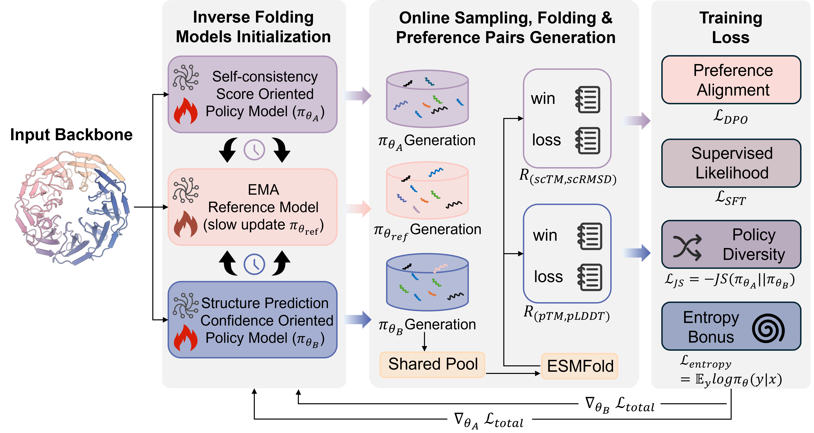

# 🔥 A Symmetric Self-play Online Preference Optimization Framework for Protein Inverse Folding




# 🏛️ Installation:
- 1.Download the source code in this repository.
- 2.Download the weights of all SSP models at [https://huggingface.co/zengwenwu/SSP](https://huggingface.co/zengwenwu/SSP/tree/main). For ESM3, we use the [peft](https://github.com/huggingface/peft); for ESM-IF1, we use the [minlora](https://github.com/changjonathanc/minLoRA); for ProteinMPNN, we provide complete weights.
- 3.Unzip all .zip packages.
- 4.Prepare the environment. Please note that this environment is prepared for ESM3. If you need to use [ProteinMPNN](https://github.com/dauparas/ProteinMPNN) and [ESM-IF1](https://github.com/facebookresearch/esm), please create their proprietary environment..
 ```
pip install requirements.txt
```

# 🔍 Inference

Once you have prepared the pdb/cif files, you can run the inference script directly..

 ```
 $ python run_design.py \
           --pdb example/1a7l.A.pdb \
           --temperature 1 \
           --num_samples 10 \
           --lora_dir "YOUR LOCAL PATH" \
           --output "SAVE FASTA PATH" \
           --device cuda:0
```


# ⚔️ Training
- 1.Before starting the training, you should first generate the [Structure Token](./gen_structure_token.py).
- 2.[Configure](./SSP/esm3_config.yaml) your PDB, token, and weight path.
- 3.Run the following command depend on the number of GPUs available to you.
 ```
bash run_ddp.sh NUM_GPU
```

# 📄 Citation
 ```
@article {Zeng2026.03.26.714453,
	author = {Zeng, Wenwu and Li, Xiaoyu and Zou, Haitao and Dou, Yutao and Zhao, Xiongjun and Peng, Shaoliang},
	title = {Symmetric Self-play Online Preference Optimization for Protein Inverse Folding},
	elocation-id = {2026.03.26.714453},
	year = {2026},
	doi = {10.64898/2026.03.26.714453},
	publisher = {Cold Spring Harbor Laboratory},
	URL = {https://www.biorxiv.org/content/early/2026/03/30/2026.03.26.714453},
	eprint = {https://www.biorxiv.org/content/early/2026/03/30/2026.03.26.714453.full.pdf},
	journal = {bioRxiv}
}
 ```
# ☎ Contact
Please feel free to contact us at wwz_cs@hnu.edu.cn, if you have any question!
